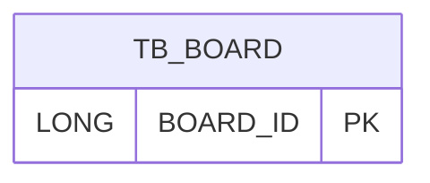

# erd-01-board

## Table Definition

### TB_BOARD

| Column(P)  | Column(L) | Type         | Constraint           | Memo |
|------------|-----------|--------------|----------------------|------|
| BOARD_ID   | 게시판 아이디   | LONG         | PK                   |      |
| BOARD_NAME | 게시판 이름    | VARCHAR(100) | NOT NULL             |      |
| DEL_YN     | 삭제 여부     | CHAR(1)      | NOT NULL DEFAULT 'N' |      |
| REG_DT     | 등록 일시     | TIMESTAMP    | NOT NULL             |      |
| UPD_DT     | 수정 일시     | TIMESTAMP    | NOT NULL             |      |

## Table Relations

